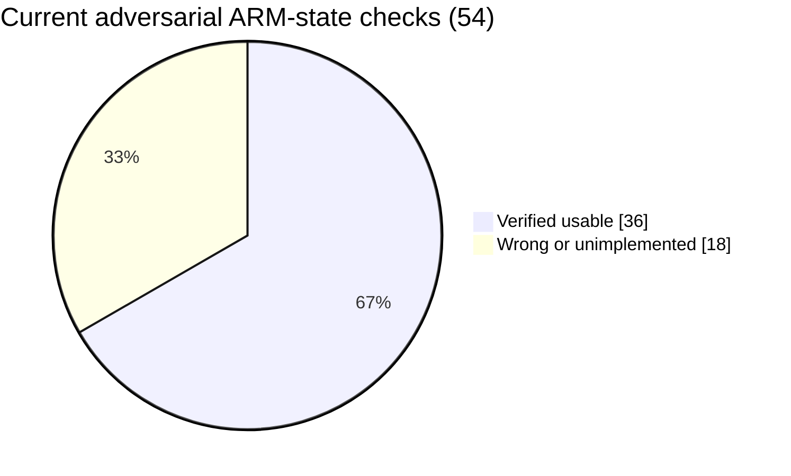
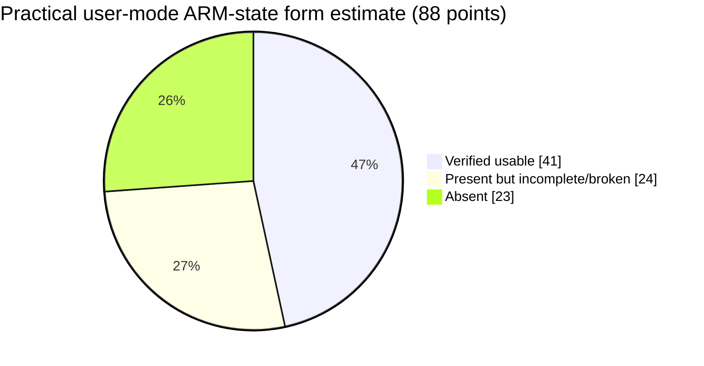

# ARM-state circuit audit — 2026-08-25

Target tested: `debug_armv4t.circ`. `armv4t.circ` was inspected read-only and
was not modified.

## Empirical result

The adversarial suite contains 54 independent, architecturally checked ROMs.
After correcting three initially invalid test immediates, 36 pass and 18
produce a wrong result. All ROMs halt; the failures are deterministic.



This 67% is the measured pass rate of the adversarial checks, not a claim that
67% of every ARMv4 encoding exists. ARM has large coprocessor, privileged,
exception, and banked-mode spaces that this project intentionally excludes.

For a broader *practical user-mode ARM-state* estimate, this audit weights
instruction forms rather than counting opcodes alone. It includes Operand2
forms, memory addressing forms, and all block-transfer addressing modes:



That model says approximately **47% verified**, **27% partially present or
broken**, and **26% absent**. The scoring model is deliberately conservative:
an opcode does not count as complete when a major operand/addressing form is
silently wrong.

> ## CORRECTION -- 2026-08-27, measured
>
> Three entries in the defect table below are **stale** and were re-measured
> against `debug_armv4t.circ` with `tests/adversarial_regression.py`:
>
> | listed defect | actual state |
> |---|---|
> | P0 ADC ignores carry-in | **PASSES** -- both carry=1 and carry=0 cases |
> | P0 SBC mishandles C=1 | **PASSES** -- both borrow and no-borrow cases |
> | P0 General block transfer not implemented | **PASSES** -- STMIA/STMDB/LDMIA/LDMDB all work with a non-SP base |
>
> Measured score: **43/54 architectural checks**. The 11 real failures reduce to
> four root causes:
>
> | root cause | failures |
> |---|---|
> | register-specified shifts | 5 |
> | MUL / MLA / SWP | 3 |
> | halfword & signed transfer | 2 |
> | scaled register offset | 1 |
>
> **Ten of the eleven sit behind one gap**: the decoder never tests `instr[7]`
> and `instr[4]`. Register shifts are `instr[4]=1`; MUL/MLA/SWP are
> `instr[7:4]=1001`; halfword transfers are `instr[7:4]=1011/1101/1111`. Only
> the scaled register offset is separate (`instr[25]` for LDR/STR, and it also
> runs into the two-read-port limit -- a register-offset store needs three).
>
> Re-measure before trusting any figure in this file.

## Confirmed defects

| Priority | Defect | Minimal symptom | Architectural impact |
|---|---|---|---|
| P0 | ADC ignores carry-in when C=1 | after `adds -1,1`, `adc 7,0` returns 7, not 8 | multiword addition is wrong |
| P0 | SBC mishandles C=1/no-borrow | `9-3` through SBC returns 5, not 6 | multiword subtraction is wrong |
| P0 | Register-specified shifts decode the immediate field | `4 LSL r3`, r3=3 returns 256, not 32 | variable shifts and much compiled C are silently wrong |
| P0 | Shifted register-offset memory fails | `[base,index,LSL #2]` reads zero while the word exists | ordinary C array indexing patterns fail |
| P0 | General block transfer is not implemented | non-SP STMIA/STMDB/LDMIA/LDMDB data and writeback fail | struct copies, context save/restore, general LDM/STM unavailable |
| P1 | MUL/MLA path returns zero | 7×6 returns 0 | multiplication, DSP kernels, address arithmetic unavailable |
| P1 | Halfword/signed-transfer decode is absent/wrong | LDRH and LDRSB return the base address (`0x1100`) | `short`, signed `char`, packed data fail |
| P1 | SWP returns zero | old memory value is not returned | ARM atomic swap unavailable |

## Verified strengths

- All fourteen tested condition predicates pass: EQ, NE, CS, CC, MI, PL, VS,
  VC, HI, LS, GE, LT, GT, and LE.
- Immediate shifts at difficult boundaries pass, including LSL/LSR/ASR 31 and
  ROR.
- Immediate and unshifted-register word addressing pass.
- Pre-index down writeback, post-index writeback, and byte lane 3 pass.
- Literal pools and program-ROM reads through a register base pass.
- PC read (`instruction address + 8`) passes.
- MOV PC, ADD PC, LDR PC, and POP PC redirects pass.
- Nested recursion, multi-register stack frames, and POP-PC returns pass when
  programs avoid the broken scaled memory form.

## Machinery and architectural weaknesses

1. The register file contains sixteen physical registers with no banking.
   There is no representation for ARM mode-banked R8–R14 or an SPSR.
2. The status register is four flag bits (NZCV), not a complete CPSR. Mode,
   interrupt-mask, state, and control fields are absent, so MRS/MSR and proper
   exception entry cannot be completed by decode changes alone.
3. The barrel shifter has one amount input, but Operand2 decoding does not
   select Rs[7:0] for register-specified shifts. The same incomplete shifter
   path affects scaled memory offsets.
4. The block-transfer controller is wired around `push_mode`, `pop_mode`, and
   `Rn==SP`. It successfully sequences the stack aliases but does not implement
   the general P/U/S/W/L matrix and arbitrary base registers.
5. `mul_32` is a large combinational CSA tree inside the ALU. It is physically
   present, but its current path is not producing architectural results and is
   also a timing/oscillation risk. A native multiplier/DSP inference is the
   safer replacement.
6. Program memory is duplicated to create a load read port. Both ROM images
   must remain byte-identical; otherwise instruction fetch and literal/table
   reads observe different programs.
7. PC redirect uses pending/target/defer/apply state around the block-transfer
   hold mechanism. It works in the tested cases, but simultaneous load-PC,
   writeback, condition failure, and block completion need permanent tests.
8. There is no visible alignment fault, data abort, prefetch abort, undefined
   instruction, SWI vectoring, or interrupt machinery.
9. Several older stack tests still use the obsolete zero-based RAM map. They
   can fail for the wrong reason now that ROM is `0x0000–0x0fff` and RAM begins
   at `0x1000`.
10. The existing headless harness converts the `is_BX` probe into a halt pin.
    That makes any internal BX look like program termination and can hide BX
    return bugs unless tests use landing markers or POP-PC returns.

## Remaining implementation checklist

| Area | State | Next concrete implementation |
|---|---|---|
| Data processing, basic Operand2 | Mostly working | correct ALU carry-in selection for ADC/SBC |
| Register-specified shifts | Broken | select Rs[7:0], implement ARM 0/32/>32 rules and shifter carry-out |
| Scaled memory offsets | Broken | route decoded shift type/amount through the address-offset shifter |
| Word/byte single transfer | Mostly working | add alignment policy and exhaustive P/U/W/register-offset tests |
| Halfword/signed transfer | Missing | decode encoding class and add byte/halfword extraction/sign extension |
| PUSH/POP aliases | Working | retain full regression coverage including POP PC |
| General LDM/STM | Missing | arbitrary Rn plus IA/IB/DA/DB address sequencing and writeback |
| Multiply family | Disconnected/broken | replace `mul_32` with built-in multiplier; implement MUL/MLA and long results |
| PC semantics | Working in tested paths | test conditional load/write PC and writeback collision cases |
| PSR access | Missing | expand CPSR representation; implement MRS/MSR flag/control masks |
| SWP | Missing | add atomic read-old/write-new sequence |
| SWI/exceptions | Missing | vector table, LR/SPSR capture, modes, banked registers |
| Thumb | Intentionally absent | no work required for an ARM-state-only architecture |
| Coprocessor instructions | Intentionally absent | only needed for broader ARMv4 system compatibility |

## Regression entry point

```sh
python3 tests/adversarial_regression.py debug_armv4t.circ
```

The command exits nonzero while architectural failures remain. That is
intentional: as fixes land, each WRONG result should turn into PASS without
changing its expected value.
